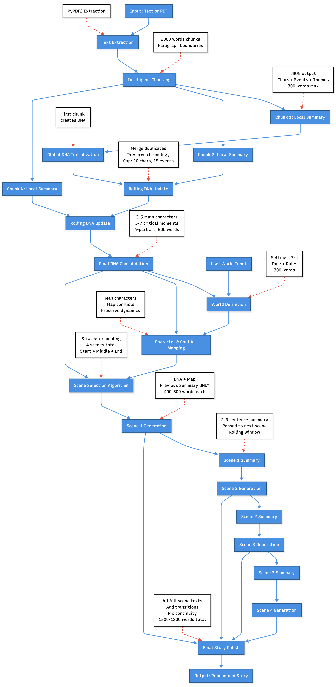

# Architecture



# Solution Design: End-to-End System Flow

## Phase 1: Source Analysis & DNA Extraction

### **Input Processing**
- PDF → PyPDF2 extraction → continuous text stream
- Raw text → direct processing

### **Intelligent Chunking**
- ~2000 words per chunk
- Paragraph boundaries preserved
- Structure:
```

[[para1, para2, para3], [para4, para5, para6], ...]

```

### **Local Summary Extraction**
- Per chunk: Extract characters (name, role, trait), events, themes
- JSON output, 300-word cap, no fabrication

### **Rolling Global DNA Accumulation**
- Chunk 1 → DNA₁
- Chunk 2 → DNA₁ + Summary₂ → DNA₂
- Chunk N → DNA₍ₙ₋₁₎ + Summaryₙ → DNAₙ
- Merges duplicates
- Maintains chronology
- Caps at 10 characters / 15 events

### **Final DNA Consolidation**
- Distills to:
- 3–5 main characters
- 5–7 critical moments
- 2–3 themes
- 4-part arc
- 500-word maximum output

---

## Phase 2: World Building & Mapping

### **World Definition**
- Input: User specs (genre, era, tone) + extracted themes
- Output (JSON): Setting, tech/magic rules, culture, tone, world-rules (300 words)

### **Transformation Mapping**
- Characters: Original → New-world equivalent
- Conflicts: Preserve emotional core, change surface details
- Output: Character maps + conflict maps + preserved dynamics

---

## Phase 3: Scene Selection Strategy

### **Adaptive Scene Planning**
- Target: 4 scenes × 400–500 words ≈ 1500 words total
- Strategic sampling from critical moments
- Always include indices: `[0, total-1]`
- Middle scenes spaced proportionally
- Tags: *opening, rising, climax, resolution*

---

## Phase 4: Scene Generation with Rolling Context

### **Contextual Scene Writing**
- Each scene receives:
- Final DNA
- Transformation Map
- Previous scene summary ONLY (rolling window)
- Output:
- Scene text (400–500 words)
- 2–3 sentence summary

### **Scene Flow**
```

Scene 1: DNA + Map → [Text₁ + Summary₁]
Scene 2: DNA + Map + Summary₁ → [Text₂ + Summary₂]
Scene 3: DNA + Map + Summary₂ → [Text₃ + Summary₃]
Scene 4: DNA + Map + Summary₃ → [Text₄]

```

---

## Phase 5: Story Assembly & Polish

### **Final Stitching**
- Input: All scenes + DNA reference
- Add 1–2 sentence transitions
- Fix continuity
- Ensure tone consistency
- Output: 1500–1800 word final story (plain text)

---

# Alternatives Considered

### **Fully Prompt-Based**
- Single mega-prompt for entire transformation
- Rejected: context limits, no structure

### **Few-Shot Prompting**
- 2–3 examples per prompt
- Rejected: huge token overhead

### **Sequential Full-Context Summaries**
- Pass all past summaries each time
- Rejected: quadratic token growth

### **Single-Pass Story Generation**
- One LLM call for whole story
- Rejected: inconsistent pacing, no debugging

---

# Challenges & Mitigations

### **Character Consistency**
- Mitigation: Transformation map injected in each scene prompt

### **Long-Story Coherence**
- Mitigation: Rolling DNA, merging, deduplication

### **JSON Errors**
- Mitigation: Retry logic + validation + regex cleanup

### **Tone Drift**
- Mitigation: Tone carried across prompts; final polish ensures consistency

### **Reproducibility**
- Mitigation: Temperature control for deterministic vs. creative outputs

---

# Future Improvements (AI-Focused Only)

- Multi-model ensemble (extraction LLM + creative LLM)
- Better OCR : Like textracts to extract more nicely.
- Multi Model Image Generation Logic and Intelligent Merging For Better Story With Images
- Agentic feedback loops (critique → fix → refine)
- Better Scalable Architecture for easily managing even bigger contexts
- Multi-language generation and translation using LLMs


